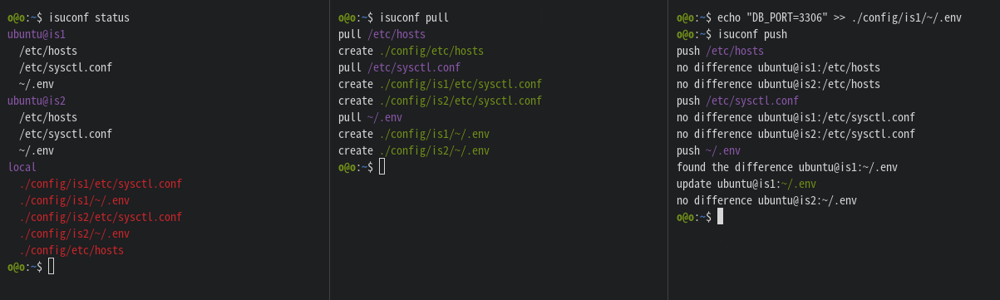

# isuconf

Isuconf is tool for manage remote server configs via ssh.



## Installing

Download binaries directly.

```bash
$ wget https://github.com/omuric/isuconf/releases/download/0.1.2/isuconf_0.1.2_x86_64-unknown-linux-musl.zip
$ unzip isuconf_0.1.0_x86_64-unknown-linux-musl.zip isuconf
$ rm isuconf_0.1.0_x86_64-unknown-linux-musl.zip
$ ./isuconf --help
```

Or build by yourself.

```bash
$ git clone git@github.com:omuric/isuconf.git
$ cd isuconf
$ cargo build --release
$ cp ./target/release/isuconf ./isuconf
$ ./isuconf --help
```

(Optional) Place it in `/usr/local/bin`.

```bash
$ sudo mv ./isuconf /usr/local/bin/isuconf
```

TODO: Change to installation via Crates.io

## Configuration

isuconf.yaml

```yml
remote:
  servers:
    - is1
    - is2
  user: ubuntu
local:
  config_root_path: ./config
targets:
  - path: /etc/hosts
    push: true
    pull: true
    sudo: true
    only: true
  - path: /etc/sysctl.conf
    push: true
    pull: true
    sudo: true
    only: false
  - path: ~/.env
    push: true
    pull: true
    sudo: false
    only: false
```
| property |                 | type    | description                                                                                                           | 
| -------  | --------------- | ------- | --------------------------------------------------------------------------------------------------------------------- | 
| remote   | servers         | array   | Target remote servers.                                                                                                | 
|          | user            | string  | User to operate remote server.                                                                                        | 
| server   |                 | string  | Remote server hostname.                                                                                               | 
| local    | config_root_dir | string  | Root directory of the configuration to be placed locally.                                                             | 
| targets  |                 | array   | Target configs.                                                                                                       | 
| target   | path            | string  | Config path. (file or directory)                                                                                      | 
|          | push            | boolean | Push local config. (default: true)                                                                                    |
|          | pull            | boolean | Pull remote config. (default: true)                                                                                   | 
|          | sudo            | boolean | Use sudo to operate the remote configuration. (default: false)                                                        | 
|          | only            | boolean | Use the same configuration for all remote servers. (default: false)<br>The layout of the local file is as follows.<br>`false`: `./{local.config_root_dir}/{server}/{config}`<br>`true`: `./{local.config_root_dir}/{config}` | 
## Usage

```bash
# Check status.
$ isuconf status
# Specify the cli configuration file. (default: ./isuconf.yml)
$ isuconf status --config ./isuconf.yml
# Pull configuration files from remote servers.
$ isuconf pull --dry-run
$ isuconf pull
# Push configuration files to remote servers.
$ isuconf push --dry-run
$ isuconf push
# Operate only on the specified path.
$ isuconf pull /etc/hosts
```

